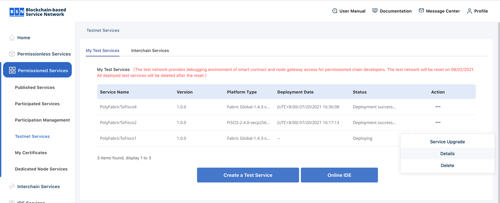

# config

See: https://www.youtube.com/watch?v=jd0lnLyluXE&t=763s

# configファイルを作成

1. サンプルからconfigファイルを作成
```sh
cp config_example.json config_fabric.json
cp config_example.json config_fisco.json
```

2. https://bsnbase.io/g/home/PermissionedServices/TestServices
Action > Details から各種情報取得してconfig_fabric.json, config_fisco.json に記入する。



3. Detailsのページから「BsnTestnetCert.zip」をDownloadして解凍

```sh
mv [Downloadしたディレクトリ]/BsnTestnetCert.zip  
unzip BsnTestnetCert.zip
```

4. userPrivateKeyとbsnPublicKeyを設定

fabricの場合
```sh
cat userAppCert/secp256r1/private_key.pem | pbcopy
# コピーした値をconfigのuserPrivateKeyに貼り付け

cat gatewayCert/gateway_public_cert_secp256r1.pem | pbcopy 
# コピーした値をconfigのbsnPublicKeyに貼り付け
```

fiscoの場合
```sh
cat userAppCert/secp256k1/private_key.pem | pbcopy
# コピーした値をconfigのuserPrivateKeyに貼り付け

cat gatewayCert/gateway_public_cert_secp256k1.pem | pbcopy 
# コピーした値をconfigのbsnPublicKeyに貼り付け
```
